# Un breve vistazo a los nuevos ajustes de EspaKodi 0.1.2

Innovación • Personalización extrema • Optimización • Antibloqueo

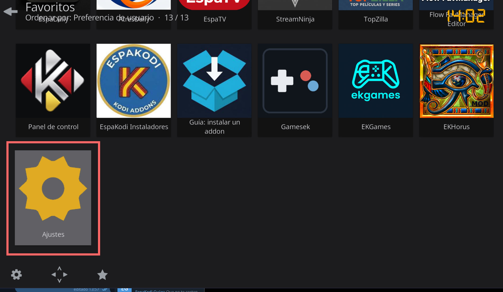

## Menú principal de los ajustes

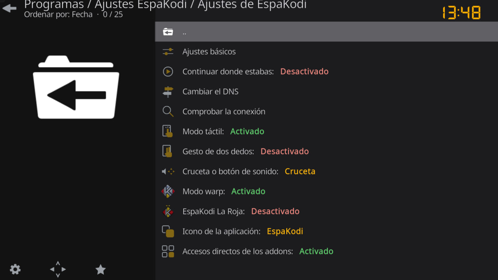

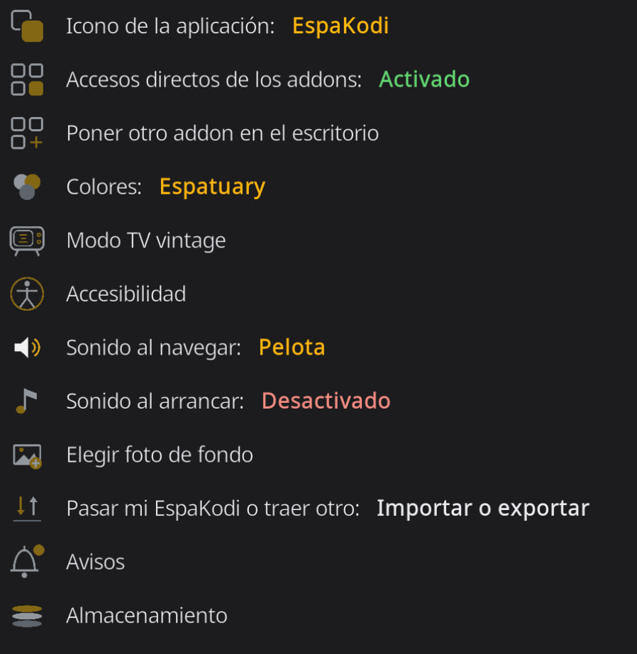

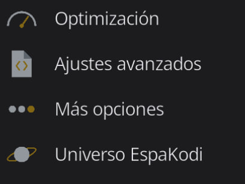

## Antibloqueo de conexión

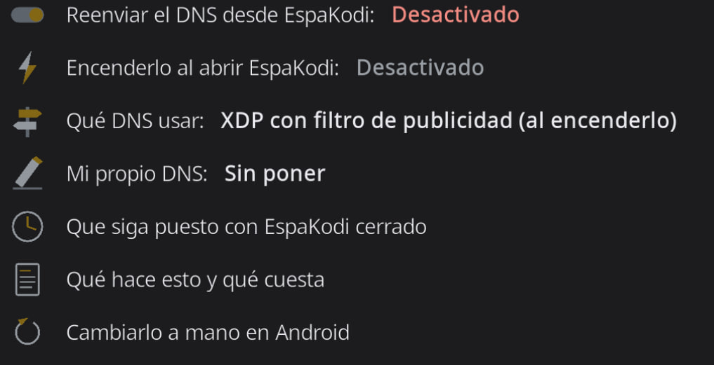

## Tests de conexión (Página 1)

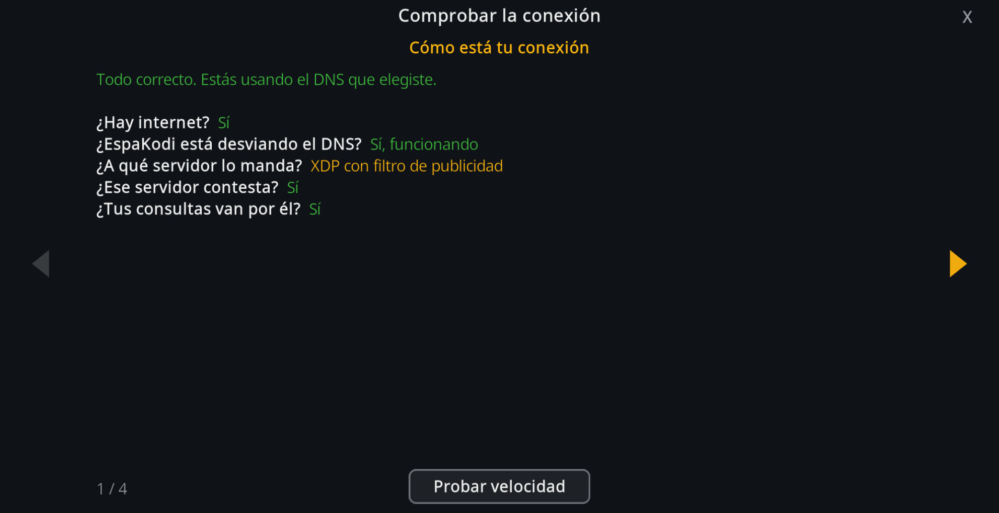

## Opciones de accesibilidad

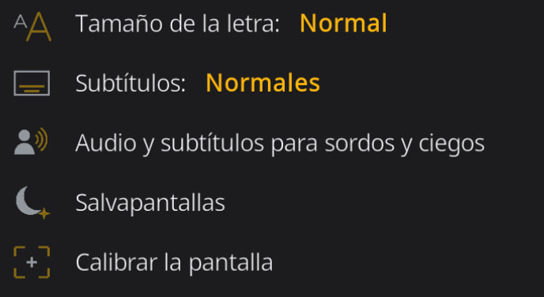

## Ajustes básicos

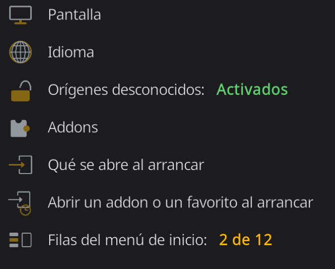

## Gestión de memoria

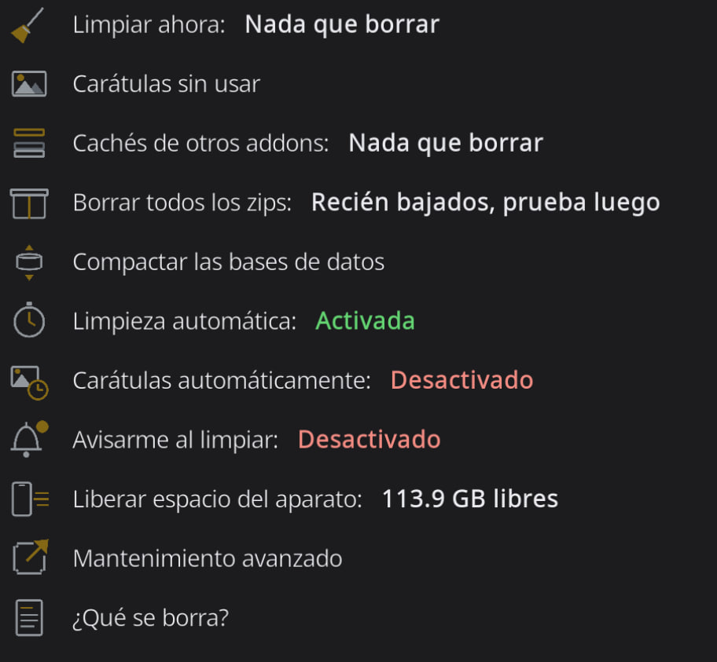

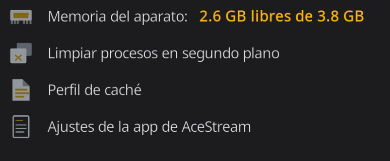

## Optimización

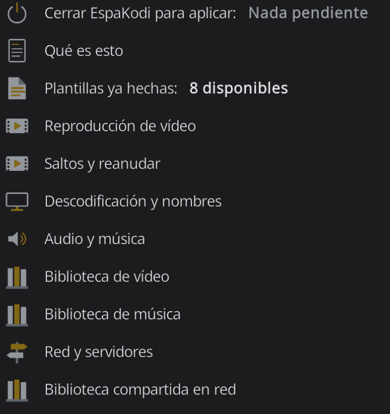

## Ajustes avanzados

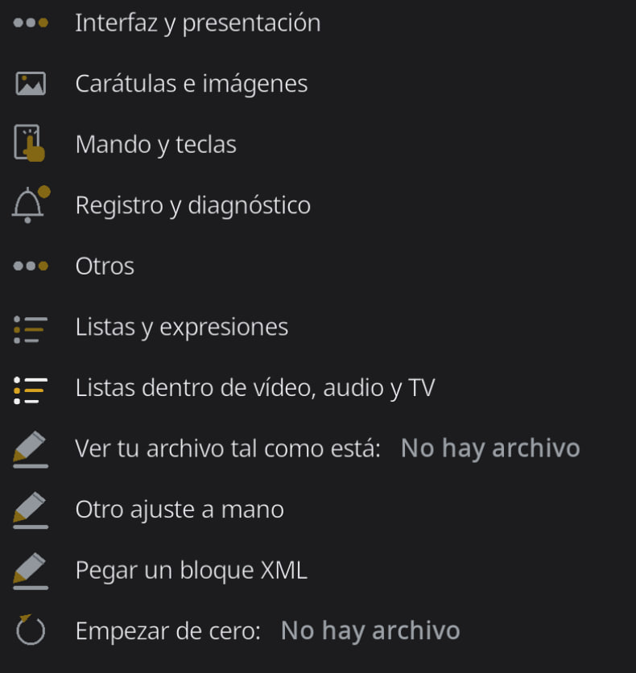

## Panel de control

Ver todo lo que puede hacer

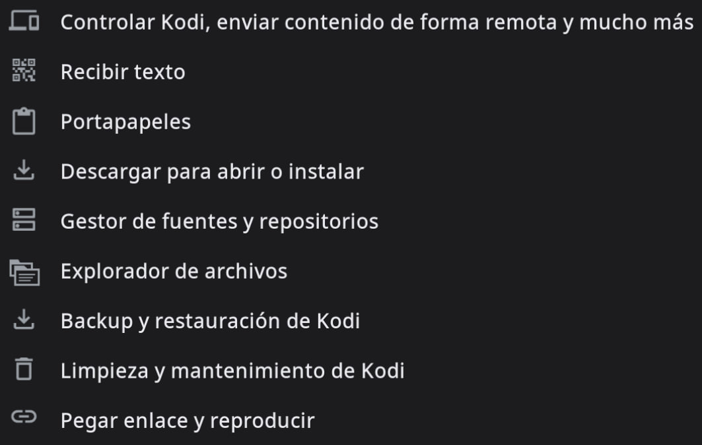

---

Publicado en [t.me/espakodi/511](https://t.me/espakodi/511) el 9 de septiembre de 2026 a las 13:00 UTC.

